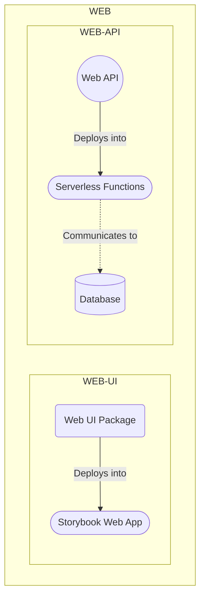
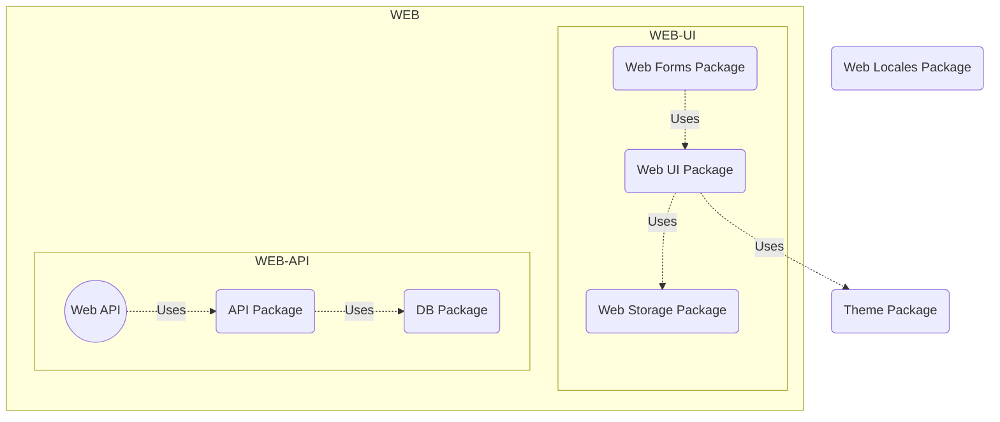

# General architecture

## Software architecture

**Diagrams might not work in GitHub Pages. If that's the case, see them
[here](https://github.com/Rock-n-Prog/static-ts-monorepo-starter-pack/blob/main/docs/architecture/general.md).**

### Components architecture

### Packages architecture

## File structure

For more info, see Turborepo file structure.

- `.github`: GitHub repo config and workflows
- `.husky`: Pre-commit hook config
- `apps`: Running apps
  - `api`: Web API (see [its docs](./apps/api.md))
- `docs`: Project documentation
- `packages`: Libraries
  - `db`: Prisma schema and client definitions (see [its docs](./packages/db.md))
  - `api`: tRPC routes and context definitions (see [its docs](./packages/api.md))
  - `theme`: Theme (color palette) definition (see [its docs](./packages/theme.md))
  - `web`: Web libraries
    - `ui`: Web UI library (see [its docs](packages/web/ui.md))
    - `forms`: Web forms library (see [its docs](./packages/web/forms.md))
    - `locales`: Web translations library (see [its docs](./packages/web/locale.md))
    - `storage`: Web storage library (see [its docs](./packages/web/storage.md))
  - `config`: Shared config
    - `eslint`: Set of eslint configs for given technologies
    - `stylelint`: Set of stylelint configs for given technologies
    - `tsconfig`: Set of TypeScript configs for given technologies
